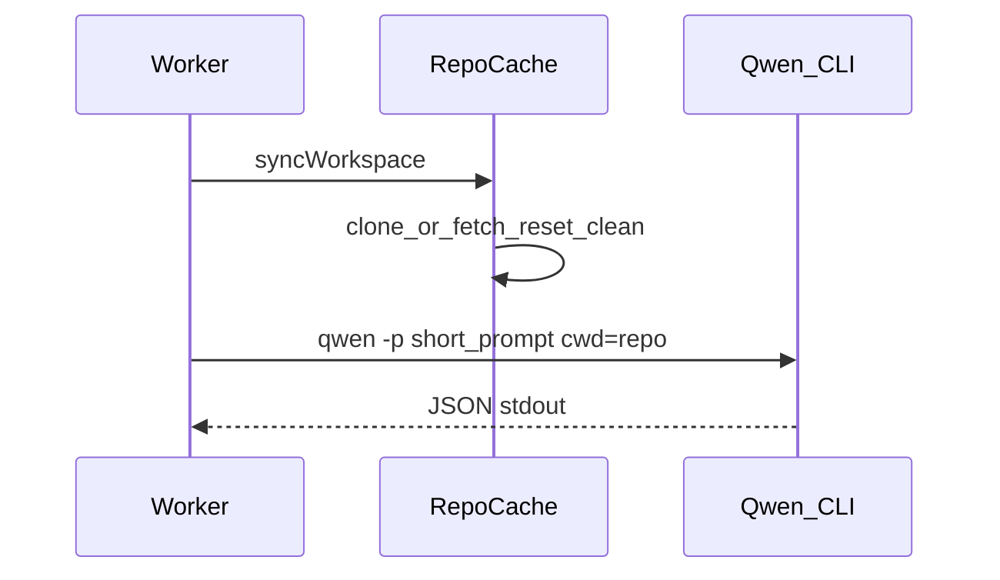

# Qwen CLI as review agent

The worker can use either the default **OpenAI-compatible HTTP API** or the **Qwen Code CLI** agent. Switch with `LLM_PROVIDER`; the default is `openai` (unchanged behavior).

With `qwen-cli`, each review runs **inside a cached git clone** of the repository. The worker syncs the clone (fetch, checkout branch, hard reset to SHA, clean), then starts Qwen with `cwd` set to that directory and a **short prompt**. Qwen uses its tools (`git diff`, read files, etc.) to inspect the code. Clones are **kept on disk** between jobs.

## Quick start (Docker)

1. Copy or edit Qwen settings (no secrets in git — API keys come from `.env` / compose):

   ```bash
   cp config/qwen/settings.json.example config/qwen/settings.json
   ```

2. For **Qwen CLI agent**, set in `.env`:

   ```env
   LLM_PROVIDER=qwen-cli
   OPENAI_API_KEY=your-key-or-local-placeholder
   ```

   The GitHub/GitLab token stored in the admin UI must allow **read access to the repository** (clone/fetch).

   For **Dashscope / Coding Plan**, edit `config/qwen/settings.json` per [Qwen Code auth docs](https://qwenlm.github.io/qwen-code-docs/en/users/configuration/auth/).

3. Start stack:

   ```bash
   docker compose up -d --build worker
   ```

4. Smoke-test inside the worker container:

   ```bash
   docker compose exec worker qwen --version
   docker compose exec worker git --version
   docker compose exec worker ls -la /var/cache/prr/repos
   ```

## Environment variables

| Variable | Default | Description |
|----------|---------|-------------|
| `LLM_PROVIDER` | `openai` | `openai` or `qwen-cli` |
| `QWEN_SETTINGS_FILE` | `./config/qwen/settings.json` | Host path mounted into the worker |
| `QWEN_SETTINGS_PATH` | `/config/qwen/settings.json` | Path inside the container |
| `QWEN_CLI_PATH` | `qwen` | CLI binary (installed in the Docker image) |
| `QWEN_CLI_TIMEOUT_MS` | `600000` | Per-phase timeout (overview / code review) |
| `QWEN_CLI_EXTRA_ARGS` | — | Optional JSON array of extra CLI flags |
| `REPO_CACHE_ROOT` | `/var/cache/prr/repos` | Persistent git cache root (Docker volume `prr-repo-cache`) |
| `REPO_CACHE_GIT_TIMEOUT_MS` | `300000` | Timeout per git command |
| `REPO_CACHE_FETCH_DEPTH` | `0` | `0` = full fetch; set e.g. `50` for shallow fetch |

`OPENAI_*` variables are used when `LLM_PROVIDER=openai`, or as API keys referenced from `settings.json` for the Qwen model.

## Repo cache layout

```
/var/cache/prr/repos/
  github/
    acme/
      my-repo/     # working tree + .git
  gitlab/
    ...
```

Per job the worker:

1. `git fetch` (or initial `git clone`)
2. `git checkout -B _prr_review <sha>`
3. `git reset --hard <sha>` and `git clean -fdx`
4. Runs Qwen twice (overview + code review) in that directory

Repositories are **not removed** after review. The next job for the same repo only fetches and resets.

### Manual cache cleanup

```bash
docker compose exec worker sh -c 'rm -rf /var/cache/prr/repos/github/OWNER/REPO'
# or remove the whole volume:
docker volume rm pullrequestreviewer_prr-repo-cache
```

Ensure enough disk space for all cached repositories.

## Model selection

- **openai**: `ReviewRule.model` in the admin UI is sent to the API.
- **qwen-cli**: default model is `model.name` in `config/qwen/settings.json`. The UI model field is informational.

## Viewing Qwen CLI output

### During execution (Docker / terminal)

Stream each stdout/stderr line to worker logs (pino):

```bash
LOG_LEVEL=debug docker compose logs -f worker
```

Disable streaming:

```env
QWEN_CLI_LOG_STREAM=false
```

Look for JSON fields `event: "qwen_cli_stream"`, `qwen_cli_start`, `qwen_cli_done`.

### After / while review (admin UI)

- **PR reviews:** Logs table → link **Qwen log** → full log on `/logs/:id` or `/repos/:repoId/logs/:id`.
- **Commit batch:** Commit review detail page shows **Qwen CLI log** block (updates in DB after each phase when status is `running`).

Logs are stored in `ReviewLog.qwenCliLog` / `CommitBatchReview.qwenCliLog` (truncated at `QWEN_CLI_LOG_MAX_CHARS`, default 500k).

To include the full prompt sent to `qwen -p` in the DB log (between `--- prompt ---` markers):

```env
QWEN_CLI_LOG_INCLUDE_PROMPT=true
```

Default is off (only `prompt_chars` and a redacted command line are stored).

### On disk (optional)

Per-phase files under `{REPO_CACHE_ROOT}/qwen-logs/{jobId}-{phase}.log` unless `QWEN_CLI_LOG_DIR` is set.

```bash
docker compose exec worker ls -la /var/cache/prr/repos/qwen-logs/
docker compose exec worker tail -f /var/cache/prr/repos/qwen-logs/<reviewLogId>-overview.log
```

## Architecture



- `backend/src/lib/repo-cache/` — git sync and changed-path detection
- `backend/src/lib/review-llm/qwen-cli-provider.ts` — spawn Qwen in workspace
- `backend/src/worker.ts` — `qwen-cli` skips API diff; `openai` keeps `buildMrDiff`
